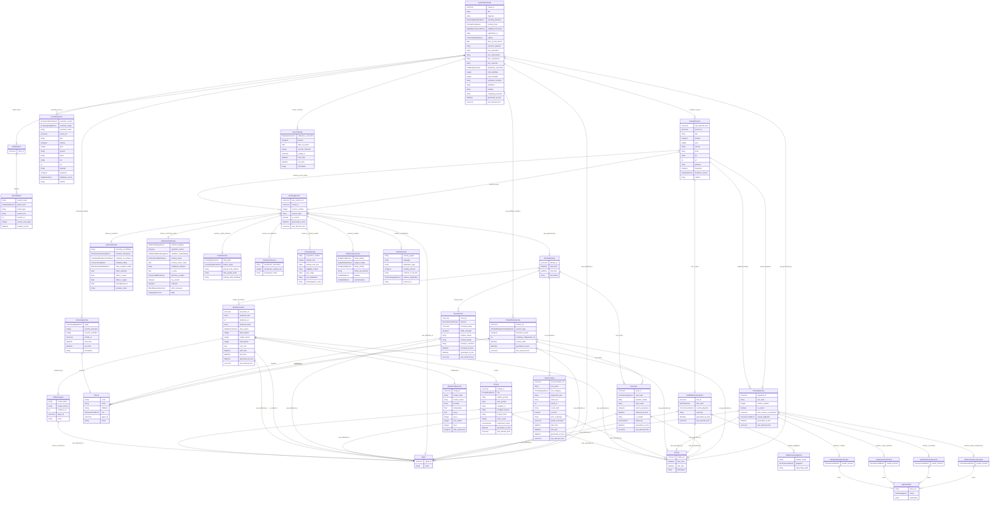

```mermaid
erDiagram
SystematicReview {
    uriorcurie review_id  
    string title  
    string objective  
    ReportingStandardEnum reporting_standard  
    PrimaryFocusEnum primary_focus  
    EligibilityFrameworkEnum eligibility_framework  
    string registration_id  
    ProtocolRegistryEnum registry  
    date date_of_last_search  
    string research_question  
    string pico_population  
    string pico_intervention  
    string pico_comparison  
    string pico_outcome  
    DatabaseEnumList databases_searched  
    integer total_identified  
    integer total_included  
    string synthesis_narrative  
    string limitations  
    string funding  
    string competing_interests  
    datetime generated_at_time  
    uriorcurie was_derived_from  
}
Agent {
    uriorcurie agent_id  
    string name  
}
Activity {
    uriorcurie activity_id  
    datetime start_time  
    datetime end_time  
    string description  
}
ArtifactStore {
    uriorcurie store_id  
}
StoredArtifact {
    string content_hash  
    ArtifactKindEnum artifact_kind  
    string media_type  
    string content_text  
    uri content_uri  
    integer content_size_bytes  
    datetime created_at_time  
}
PreWorkflowSession {
    uriorcurie session_id  
    PreWorkflowSessionTypeEnum session_type  
    stringList decisions_locked  
    uri resulting_configuration_uri  
    datetime session_date  
    datetime generated_at_time  
    uriorcurie was_derived_from  
}
UserInput {
    uriorcurie input_id  
    UserInputTypeEnum input_type  
    string question_asked  
    string input_value  
    stringList options_presented  
    datetime captured_at_time  
    string ui_context  
    uriorcurieList influences  
    datetime generated_at_time  
    uriorcurie was_derived_from  
}
Person {
    string orcid  
    string email  
    string affiliation  
    ReviewerRoleEnum role  
    uriorcurie agent_id  
    string name  
}
ExcludedSource {
    ExclusionReasonEnum exclusion_reason  
    ScreeningStageEnum exclusion_stage  
    string exclusion_notes  
    uriorcurie source_id  
    string title  
    stringList authors  
    integer year  
    string journal  
    string pmid  
    string doi  
    uri url  
    string abstract  
    stringList keywords  
    DatabaseEnum database_source  
    string citation  
}
IncludedSource {
    uriorcurie was_derived_from  
    uriorcurie source_id  
    string title  
    stringList authors  
    integer year  
    string journal  
    string pmid  
    string doi  
    uri url  
    string abstract  
    stringList keywords  
    DatabaseEnum database_source  
    string citation  
}
RiskOfBiasAssessment {
    uriorcurie rob_id  
    RoBToolEnum tool_used  
    ConcernLevelEnum overall_judgment  
    string summary  
    datetime generated_at_time  
    uriorcurie was_derived_from  
}
RoBDomainJudgment {
    string domain_name  
    ConcernLevelEnum judgment  
    string supporting_quote  
}
CriticalAppraisal {
    uriorcurie appraisal_id  
    string tool_used  
    integer version_number  
    boolean is_current  
    uriorcurie was_revision_of_appraisal  
    ConcernLevelEnum overall_judgment  
    datetime generated_at_time  
    uriorcurie was_derived_from  
}
BiasTransparencyDomain {
    ConcernLevelEnum overall_concern  
}
AppraisalItem {
    string item_text  
    ItemRatingEnum rating  
    string justification  
}
MethodsAnalysisDomain {
    ConcernLevelEnum overall_concern  
}
DataCollectionDomain {
    ConcernLevelEnum overall_concern  
}
SamplePopulationDomain {
    ConcernLevelEnum overall_concern  
}
ChartingRecord {
    uriorcurie was_revision_of  
    uriorcurie record_id  
    integer version_number  
    string version_label  
    boolean is_current  
    datetime generated_at_time  
    uriorcurie was_derived_from  
}
ChartingActivity {
    uriorcurie activity_id  
    datetime start_time  
    datetime end_time  
    string description  
}
ReviewEvent {
    uriorcurie event_id  
    ReviewDecisionEnum decision  
    uriorcurie reviewed_entity  
    stringList fields_changed  
    string original_values  
    string revised_values  
    string reviewer_comment  
    datetime reviewed_at_time  
    datetime generated_at_time  
    uriorcurie was_derived_from  
}
ToolInvocation {
    uriorcurie tool_invocation_id  
    string tool_name  
    ToolCategoryEnum tool_category  
    string arguments_json  
    string result_text  
    uri result_uri  
    string result_hash  
    boolean success  
    string error_message  
    uriorcurie parent_invocation  
    datetime start_time  
    datetime end_time  
    datetime generated_at_time  
    uriorcurie was_derived_from  
}
ModelInvocation {
    uriorcurie invocation_id  
    string response_text  
    uri response_uri  
    string response_hash  
    StopReasonEnum stop_reason  
    integer input_tokens  
    integer output_tokens  
    integer total_tokens  
    float cost_usd  
    datetime start_time  
    datetime end_time  
    datetime generated_at_time  
    uriorcurie was_derived_from  
}
SoftwareAgent {
    string model_name  
    string model_version  
    uri software_url  
    uriorcurie agent_id  
    string name  
}
ModelConfiguration {
    uriorcurie config_id  
    string model_name  
    string model_version  
    string provider  
    float temperature  
    float top_p  
    integer top_k  
    integer max_tokens  
    integer seed  
    stringList stop_sequences  
}
Prompt {
    uriorcurie prompt_id  
    PromptRoleEnum role  
    string system_prompt  
    string user_prompt  
    string template_id  
    string template_version  
    string prompt_hash  
    integer token_count  
    uriorcurieList referenced_inputs  
    datetime generated_at_time  
    uriorcurie was_derived_from  
}
SynthesisFields {
    string summary_of_findings  
    NarrativeFrameworkEnum narrative_framework  
    CertaintyOfEvidenceToolEnum certainty_of_evidence  
    ConcernLevelEnum certainty_rating  
    MetaAnalysisModelEnum meta_analysis_model  
    float effect_estimate  
    float effect_ci_lower  
    float effect_ci_upper  
    float heterogeneity_i2  
    string reviewer_notes  
}
MethodsAndResults {
    MethodCategoryEnum method_category  
    stringList algorithm_names  
    ValidationMethodologyEnum validation_methodology  
    PerformanceMetricEnum primary_metric  
    float primary_metric_value  
    string confidence_interval  
    float p_value  
    DirectionOfEffectEnum direction_of_effect  
    stringList key_results  
    stringList outcome  
    EffectMeasureEnumList effect_measure  
    FlagTypeEnumList flags  
}
DataCollection {
    DataTypeEnumList data_types  
    FeatureTypeEnumList feature_types  
    string ground_truth_method  
    string data_quality_notes  
    string missing_data_handling  
}
ComparisonGroup {
    string comparator_description  
    integer comparator_sample_size  
    string comparator_notes  
}
PrimarySample {
    string population_studied  
    integer sample_size  
    string sample_size_text  
    string eligibility_criteria  
    string age_range  
    string sex_distribution  
    string demographics_notes  
}
StudyDesignSection {
    StudyDesignEnum study_design  
    SubjectModelEnum subject_model  
    StudySettingEnum study_setting  
    string follow_up_duration  
    YesNoNREnum blinding  
    YesNoNREnum randomization  
}
PublicationInfo {
    string country_region  
    string language  
    string publication_type  
    stringList funding_sources  
    string conflicts_of_interest  
    ProtocolRegistryEnum protocol_registration  
    string protocol_id  
}
ScreeningActivity {
    ScreeningStageEnum stage  
    integer records_screened  
    integer records_excluded  
    uriorcurie activity_id  
    datetime start_time  
    datetime end_time  
    string description  
}
SearchActivity {
    DatabaseEnumList databases_searched  
    stringList queries  
    date date_of_search  
    integer records_retrieved  
    uriorcurie activity_id  
    datetime start_time  
    datetime end_time  
    string description  
}

SystematicReview ||--}o SearchActivity : "search_activities"
SystematicReview ||--}o ScreeningActivity : "screening_activities"
SystematicReview ||--}o IncludedSource : "included_sources"
SystematicReview ||--}o ExcludedSource : "excluded_sources"
SystematicReview ||--}o PreWorkflowSession : "pre_workflow_sessions"
SystematicReview ||--|o ArtifactStore : "artifact_store"
SystematicReview ||--|o Activity : "was_generated_by"
SystematicReview ||--|o Agent : "was_attributed_to"
ArtifactStore ||--}o StoredArtifact : "artifacts"
PreWorkflowSession ||--|o Person : "conducted_by"
PreWorkflowSession ||--}o Person : "participants"
PreWorkflowSession ||--}o UserInput : "user_inputs"
PreWorkflowSession ||--|o Activity : "was_generated_by"
PreWorkflowSession ||--|o Agent : "was_attributed_to"
UserInput ||--|o Activity : "was_generated_by"
UserInput ||--|o Agent : "was_attributed_to"
IncludedSource ||--|o ChartingRecord : "charting_record"
IncludedSource ||--}o ChartingRecord : "charting_record_history"
IncludedSource ||--|o CriticalAppraisal : "critical_appraisal"
IncludedSource ||--}o CriticalAppraisal : "appraisal_history"
IncludedSource ||--|o RiskOfBiasAssessment : "risk_of_bias"
RiskOfBiasAssessment ||--}o RoBDomainJudgment : "domain_judgments"
RiskOfBiasAssessment ||--|o Activity : "was_generated_by"
RiskOfBiasAssessment ||--|o Agent : "was_attributed_to"
CriticalAppraisal ||--|o SamplePopulationDomain : "domain_1_sample"
CriticalAppraisal ||--|o DataCollectionDomain : "domain_2_data_collection"
CriticalAppraisal ||--|o MethodsAnalysisDomain : "domain_3_methods"
CriticalAppraisal ||--|o BiasTransparencyDomain : "domain_4_bias_transparency"
CriticalAppraisal ||--|o Activity : "was_generated_by"
CriticalAppraisal ||--|o Agent : "was_attributed_to"
BiasTransparencyDomain ||--}o AppraisalItem : "items"
MethodsAnalysisDomain ||--}o AppraisalItem : "items"
DataCollectionDomain ||--}o AppraisalItem : "items"
SamplePopulationDomain ||--}o AppraisalItem : "items"
ChartingRecord ||--|o PublicationInfo : "section_a_publication"
ChartingRecord ||--|o StudyDesignSection : "section_b_design"
ChartingRecord ||--|o PrimarySample : "section_c_primary_sample"
ChartingRecord ||--|o ComparisonGroup : "section_d_comparison"
ChartingRecord ||--|o DataCollection : "section_e_data_collection"
ChartingRecord ||--|o MethodsAndResults : "section_f_methods_results"
ChartingRecord ||--|o SynthesisFields : "section_g_synthesis"
ChartingRecord ||--|o ChartingActivity : "was_generated_by"
ChartingRecord ||--|o Agent : "was_attributed_to"
ChartingActivity ||--}o ModelInvocation : "model_invocations"
ChartingActivity ||--}o ToolInvocation : "tool_invocations"
ChartingActivity ||--}o UserInput : "user_inputs"
ChartingActivity ||--}o ReviewEvent : "review_events"
ReviewEvent ||--|| Person : "reviewer"
ReviewEvent ||--|o Activity : "was_generated_by"
ReviewEvent ||--|o Agent : "was_attributed_to"
ToolInvocation ||--|o Activity : "was_generated_by"
ToolInvocation ||--|o Agent : "was_attributed_to"
ModelInvocation ||--|| Prompt : "prompt"
ModelInvocation ||--|| ModelConfiguration : "configuration"
ModelInvocation ||--|o SoftwareAgent : "performed_by"
ModelInvocation ||--|o Agent : "on_behalf_of"
ModelInvocation ||--|o Activity : "was_generated_by"
ModelInvocation ||--|o Agent : "was_attributed_to"
SoftwareAgent ||--|o Agent : "acted_on_behalf_of"
Prompt ||--|o Activity : "was_generated_by"
Prompt ||--|o Agent : "was_attributed_to"
ScreeningActivity ||--|o Person : "screener"

```

